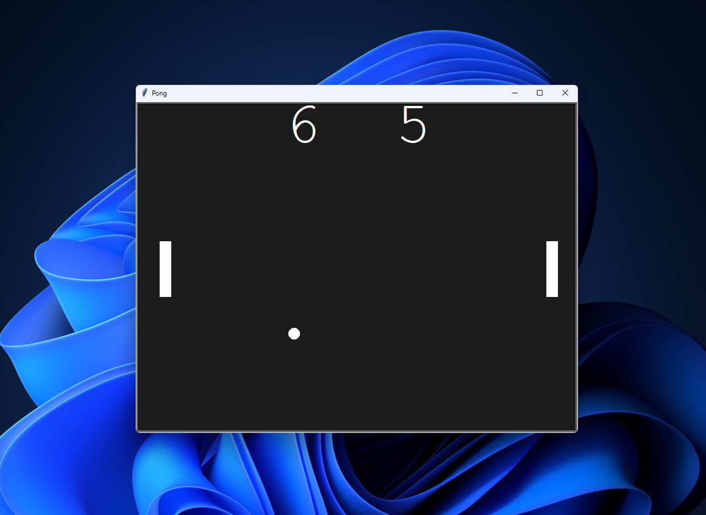

# Pong Game

  

## Overview

The Pong Game is a classic arcade game implemented using Python with the Turtle graphics module. It provides a nostalgic gaming experience where two players control paddles to hit a ball back and forth.

## Features

- Two-player mode for interactive gameplay.
- Keep track of scores for both players.

## Requirements

- Windows OS

## Installation

1. Go to the Releases section of this repository.
2. Download the latest release (`Pong_game_v0.1.0.zip`).
3. Extract the downloaded ZIP file to a location of your choice.
4. Double-click on `pong_game_v0.1.0.exe` to start playing the game.

## Gameplay

- Player 1 uses the `W` and `S` keys to control their paddle.
- Player 2 uses the up and down arrow keys to control their paddle.
- The game starts when the ball is served, and players take turns hitting it.
- The ball increases speed after each successful hit.
- The game ends when one player fails to hit the ball.

## Screenshot

## Configuration

You can customize the following parameters in `pong_game.py`:

- `PADDLE_SPEED`: Adjust the speed of the paddles for different gameplay experiences.
- `BALL_SPEED`: Set the initial speed of the ball.
- `BALL_ACCELERATION`: Define how much the ball's speed increases after each hit.

## Contributing

If you'd like to contribute, please fork the repository and create a pull request. Please make sure to update tests as appropriate.

## Support

If you encounter any issues or have suggestions, please [open an issue](https://github.com/muhzinkhan/pong-game/issues).

## Roadmap

- [ ] Implement single-player mode with AI opponent.
- [ ] Add sound effects for better gameplay feedback.
- [ ] Create additional themes for the game.

## Authors

- [Muhzin Khan](https://github.com/muhzinkhan)
